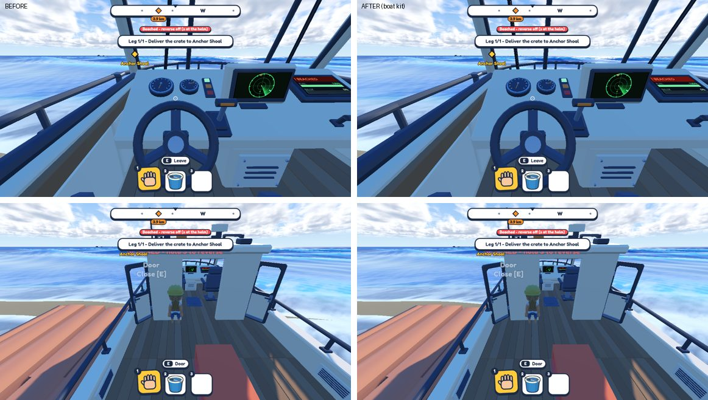
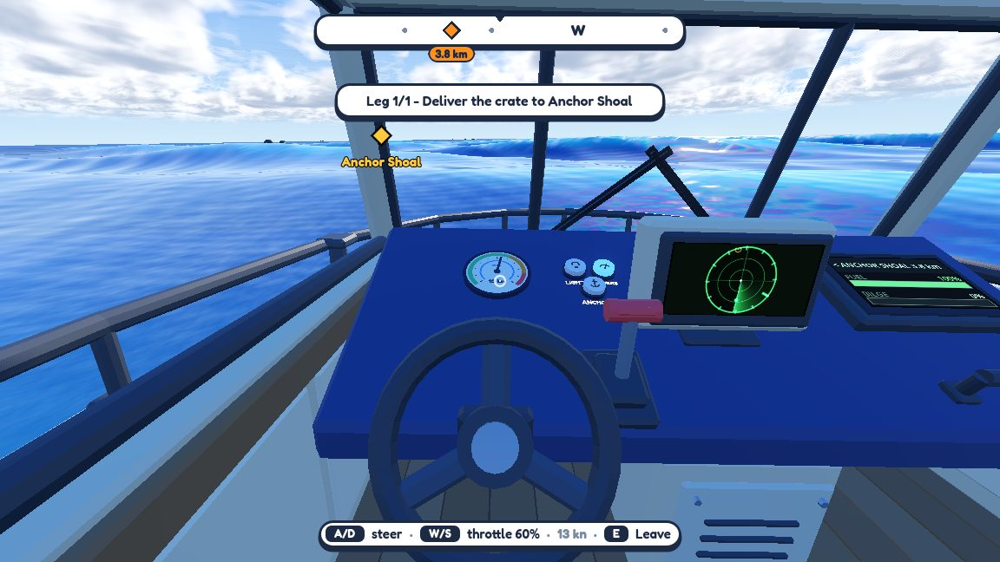
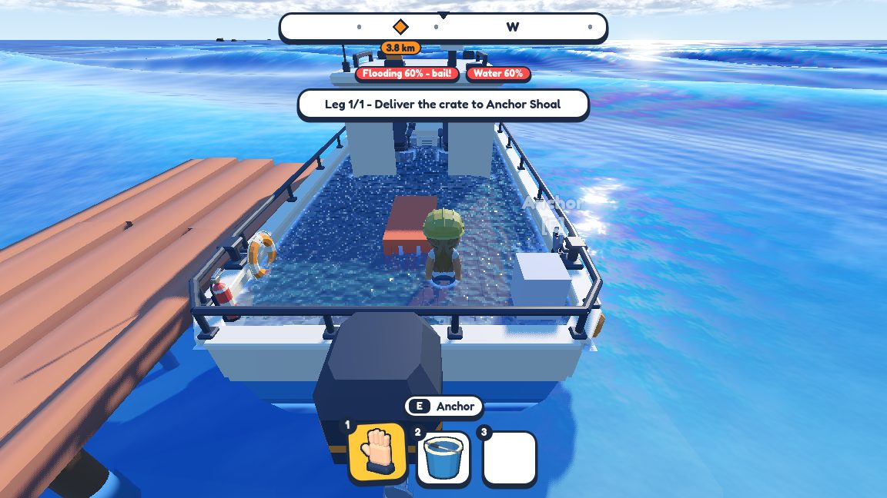
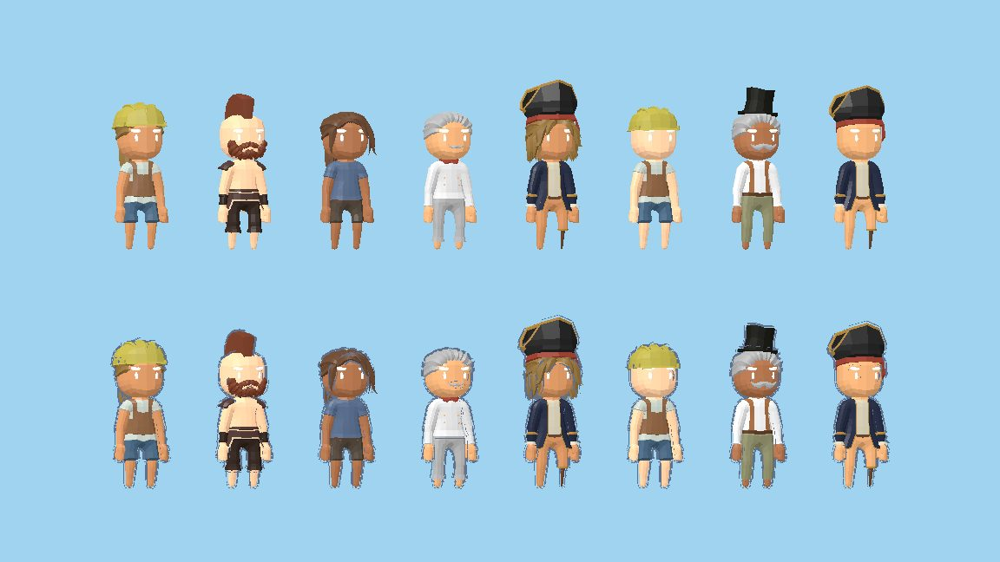

# Boat kit and first playtest — 22–23 September 2026

**First builds for friends.** Versions 0.1.0 and 0.2.0 went out on the 22nd, with controller support and a settings
menu. 0.3.0 and 0.3.1 followed on the 23rd.

**The boat kit.** A boat used to be one big hand-built scene. Now a boat is a hull with named mount points, plus a
layout that says which part goes where: helm console, tool hooks, doors, and so on. That is what later made a second
boat possible.

**Polish.**
- Tools hang on hooks that actually sit clear of the rail.
- Piers grow until the berth is deep enough, so the boat no longer starts aground.
- The helm got a new console.
- Aimed buttons glow with an outline.

**Deck water.** Water on deck is now a visible sheet that sloshes as the boat rolls. You can also throw a bucket of it
overboard.

**Crew restyle.** A pass on how the characters look.

