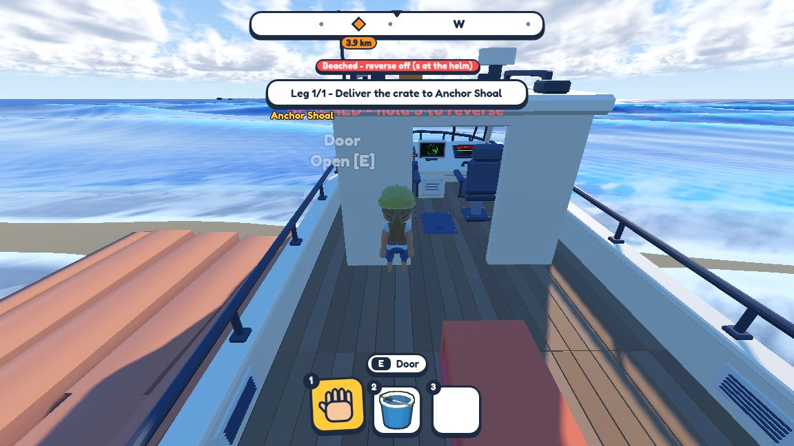
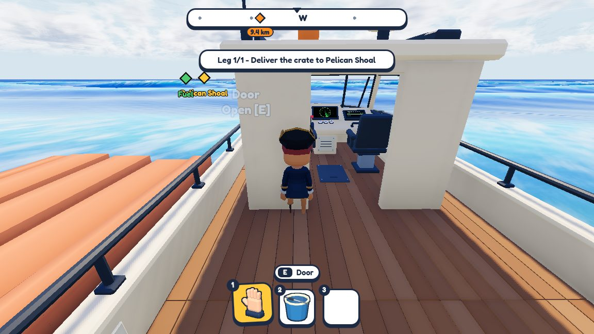
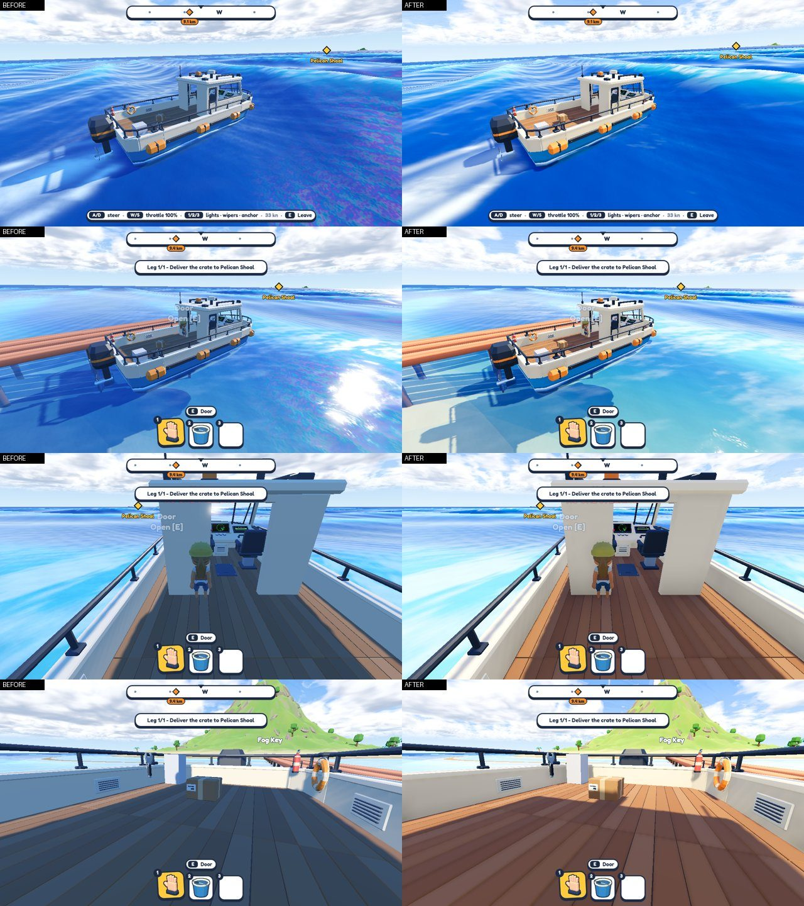
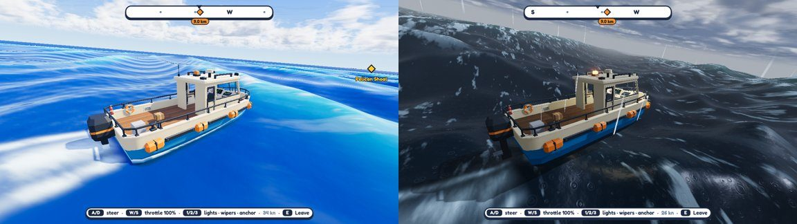

# The toy-box look — 25–26 September 2026

The goal: soft, warm and bright, like a toy. Before this, the deck read as navy blue even though the wood is brown.
The shadows were lit only by the saturated blue sky. Now the ambient light mixes toward a warm neutral and the sun
sits higher.

Same spot, first playtest build (0.1.0, 22 Sept) vs today:

| 0.1.0 | Now |
|---|---|
|  |  |

The lighting pass, before and after, from the same cameras:

**Storms that build.** The run director now paces a voyage in beats: a calm departure, then an encounter that
builds up, peaks and eases, then time to recover, and again. The encounter can be a squall, fog with rocks in it, or
a waterspout.

Also this week: new pirate-style crew (five rounds of previews), and a continuous bulwark rail around the boat
instead of 15 boxes with a notch at every joint.
