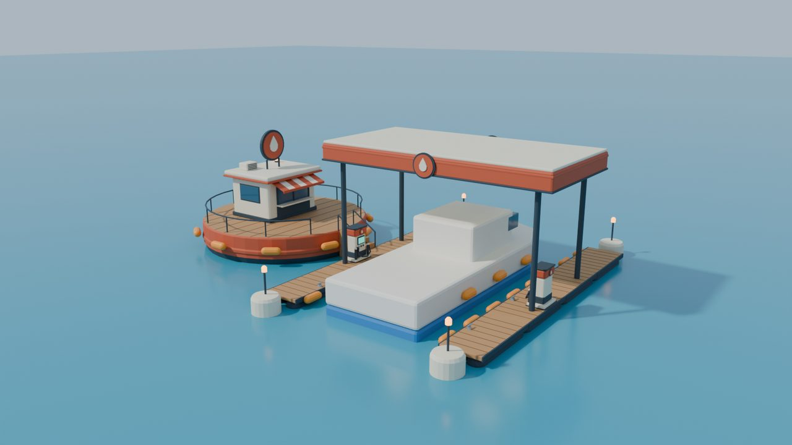
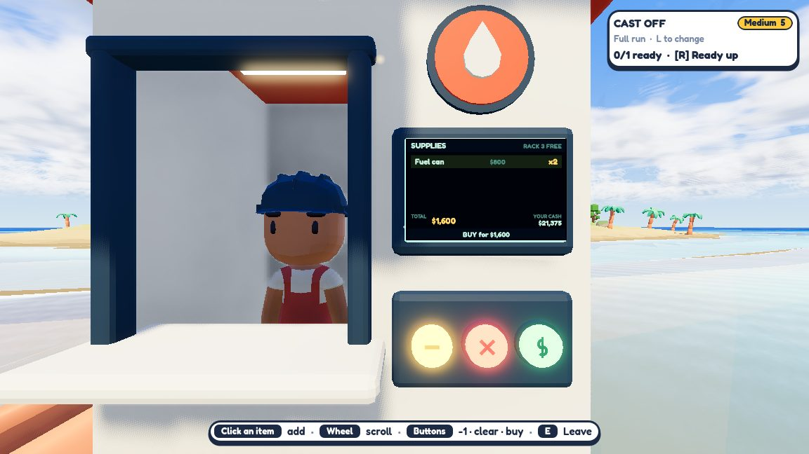
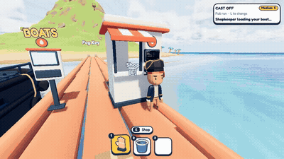
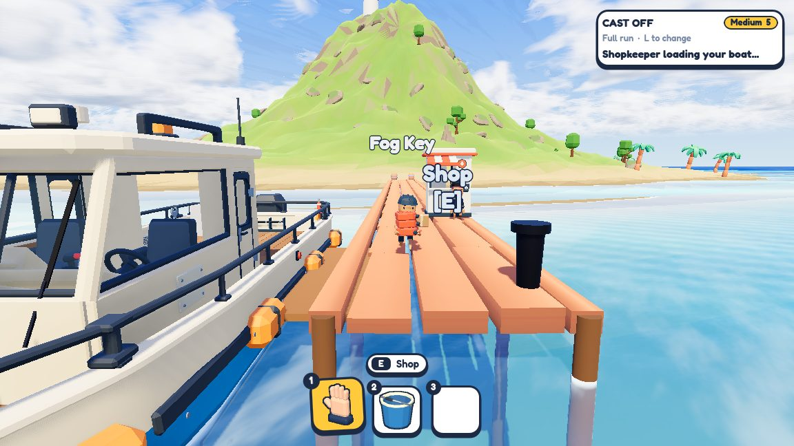
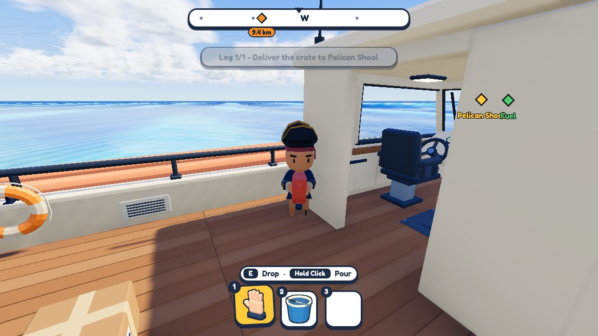

# Fuel, shops and a shopkeeper — 26–27 September 2026

**Why fuel ran out.** It wasn't a bug. A full tank at full throttle does about 6–7 km, and a long leg is 9–10 km.
Burn grows faster than throttle, so at half throttle you make it. That gives the crew a choice: go slow, or stop for fuel.

**Fuel station.** A gas station on a big buoy in the middle of the sea: a hub with a shop, two wooden arms making a
lane for the boat, a canopy and a pump on each side. It took about a dozen colour rounds to settle on red.

**Pier shop.** Buy fuel cans, patch plates and extinguisher refills at a stall on the start pier. Items are rows on
the kiosk screen, and you pay with the arcade buttons.

A paid order sends the shopkeeper down the pier toward the tug:

([MP4](../media/fuel-and-shops/shopkeeper-tug.mp4))

For bigger orders, he carries a wobbly pile and stacks it in the boat's supply rack.

A fuel can is carried with two hands and poured into the filler cap on the side of the boat.

**Limited kit.** You start a run with one pack of three patch plates, and the extinguisher has 12 seconds of spray.
Run out and you'll need the shop.

Also fixed: a 3-second freeze the first time fog rolled in (switching fog on and off rebuilt every shader).
