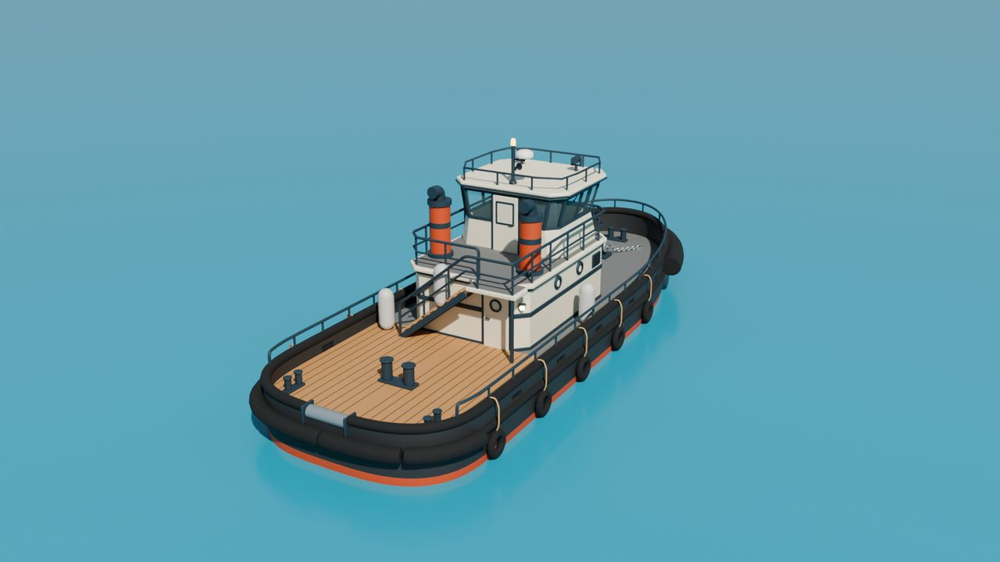
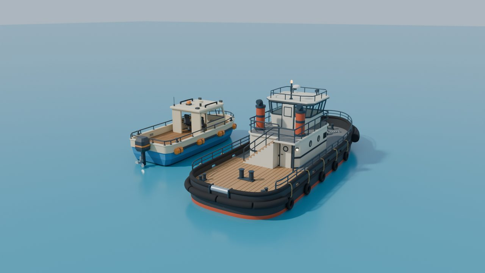
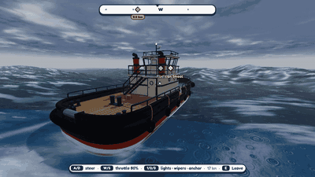
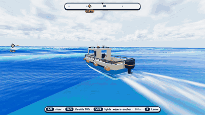
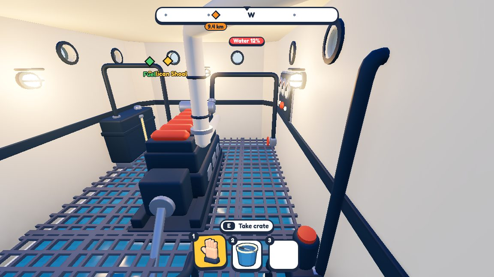
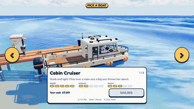

# The harbour tug — 27 September 2026

Boat number two. The cabin cruiser is quick and light. The tug is heavy, slow and steady: it shrugs off the waves,
and the trouble happens below, in the engine room.

The model is built by a script in Blender: hull, fenders, deckhouse, wheelhouse on a tapered pedestal, twin stacks,
searchlights, an open stair and doors that swing on real hinges. Then it was trimmed from 73k to 56k triangles with no
visible change. Thanks to the boat kit, the same mount points (helm, hooks, rack, filler caps) plug straight in.

**Handling.** A first pass makes it heavier and slower than the cruiser, but much steadier in a storm:

([MP4, 16 s](../media/harbour-tug/tug-storm.mp4))

For comparison, the cruiser on a calm day:

([MP4](../media/harbour-tug/cruiser-calm.mp4))

**Engine room.** A grating over the bilge, one exhaust, portholes for daylight.

**Boat kiosk.** A kiosk at the pier to flip through the boats, see their speed, steadiness and room, and buy one
with the cash from your runs.

([MP4](../media/harbour-tug/kiosk-flip.mp4))
