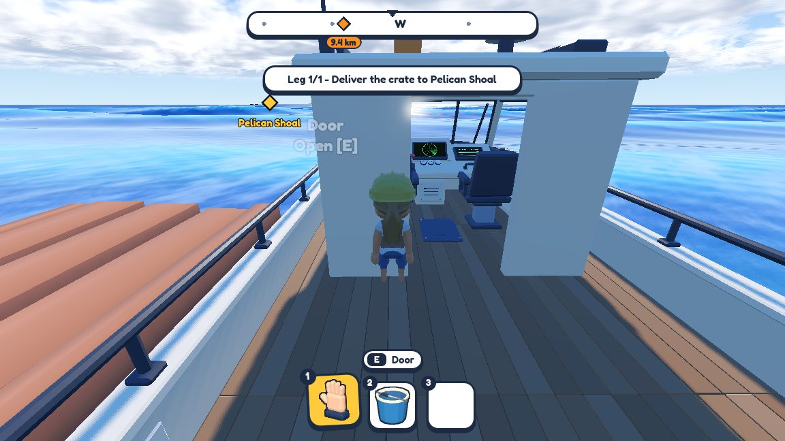
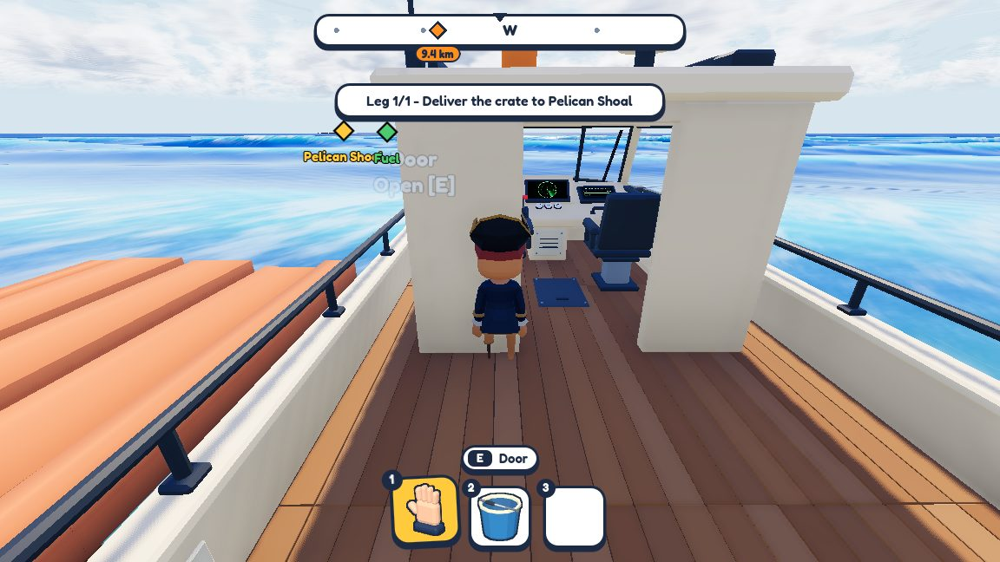
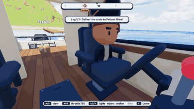

# Build 0.4.0 — 29 September 2026

The first new playtest build since 0.3.5 (25 September). Everything from the last four posts is in it:

- the [toy-box lighting](2026-09-26-toy-box-look.md) and storms that build and ease
- [fuel, the fuel station and the pier shop](2026-09-27-fuel-and-shops.md)
- [the harbour tug](2026-09-27-harbour-tug.md) and the boat kiosk
- [engine fires](2026-09-29-engine-fire.md) you fight with the extinguisher

Same camera, 0.3.5 vs 0.4.0:

| 0.3.5 | 0.4.0 |
|---|---|
|  |  |

At the helm of the cruiser, turning away from the start island:

([MP4](../media/build-0.4.0/helm.mp4))

Small extra: the engine-fire debug key moved to Shift+F for keyboards without function keys.
