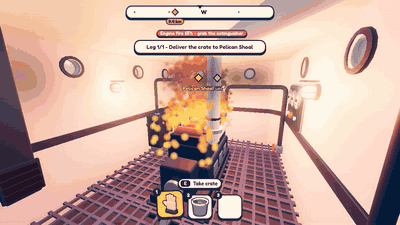

# Engine fire — 28–29 September 2026

The old engine fire was a few big glowing blobs, and its smoke rose straight through the engine-room ceiling into the
helm. The new one is many small soft particles that build a body of fire around the engine, plus a few thin trails.

On the tug the smoke stays under the engine-room roof and vents out through the side wall:

([MP4](../media/engine-fire/fire-tug.mp4))

On the cruiser the engine sits out in the open at the stern, so the smoke simply rises:

([MP4](../media/engine-fire/fire-cruiser.mp4))

Also fixed: the fire is now reachable with the extinguisher, and the spray follows the boat instead of being left
behind in the water.

Also this week: waves no longer show up inside the hull, and the hitches when fog or a waterspout starts are gone.
