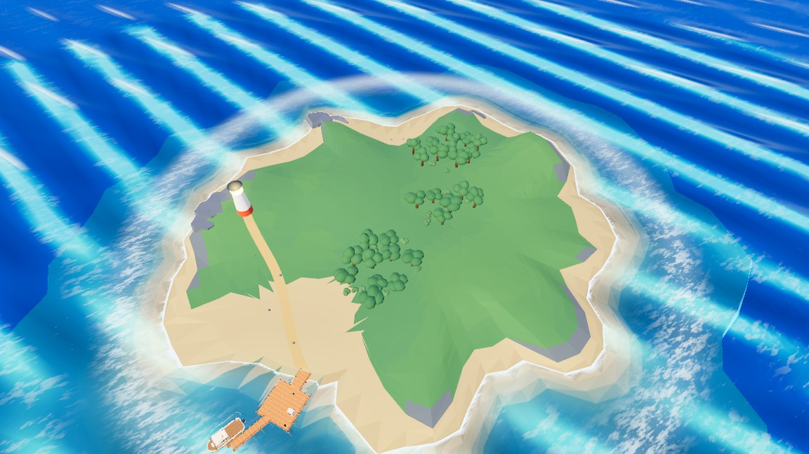
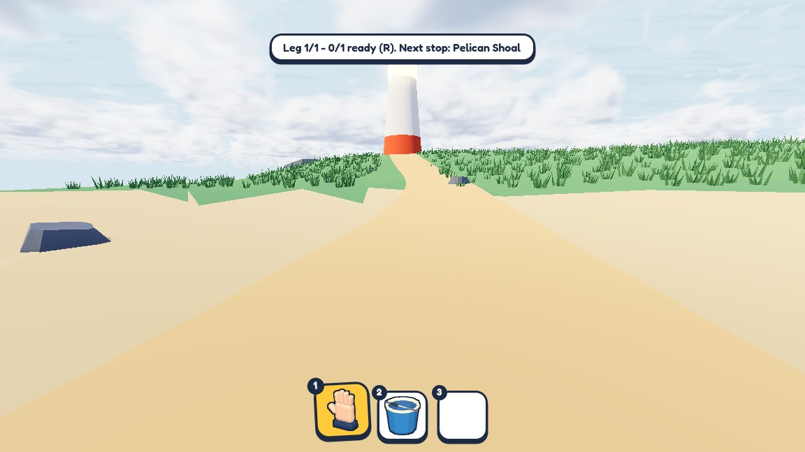
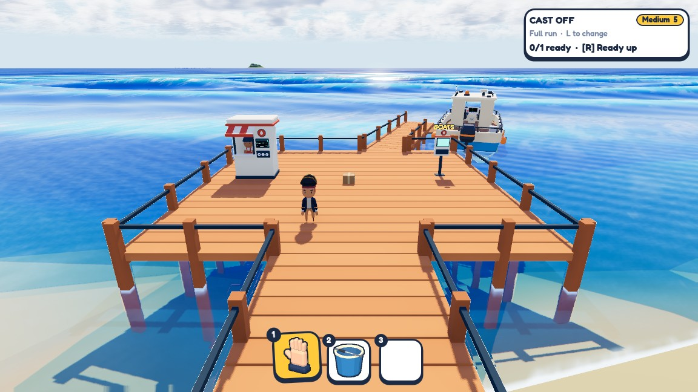

# Harbour and islands — 30 September 2026

Updated 1 October with the rest of the island and lobby pass.

## Where the first pass started

The new modular dock gave the shop, boat selector and moored boat a proper starting area.
The first procedural island pass added grassy hills, tree groups, coastal rocks and a lighthouse
path. Different seeds produce different layouts.

That first terrain still looked too bumpy, jagged and dark beside the bright sea. The later passes
focused on a lower coastal shape, cleaner colour regions and a better view from the character.

## The later island pass

The grass is brighter and less lime, with subtle height tint. Softer coves and cleaner sand edges
keep the grass and beach distinct, with a restrained grassy fringe along the transition.
Broader rises replace the sharper bumps.

The trees now have crooked trunks, visible forks and varied crowns. Woodland pockets, open
meadow and the lighthouse headland give the island clearer areas. Broad grass cover sways in
the wind; it is drawn in batches and fades with distance to keep its cost manageable.

The first character-height review showed the starter island still felt like a mountain. Its
footprint and height were reduced, with gentler slopes on the approach. Taller destination
profiles remain available in the same generator.

The walk to the lighthouse now reads as a low island rise. The starting island may shrink
further once there is more reason to explore it; that extra reduction has not been made yet.

## Dock and lobby finish

The lobby camera now faces the dock head-on. Wider plank seams and edge smoothing make the
small deck details more readable. The triangular gap where the angled boat branch met the
main deck has also been filled, including its walkable surface and rail.

This finishes the current island and lobby pass. The environment can still improve with
playtesting: grass is fairly spiky at character height, rocks remain chunky, and distant sea
detail can still look busy. These are development captures, not a new playtest release.
