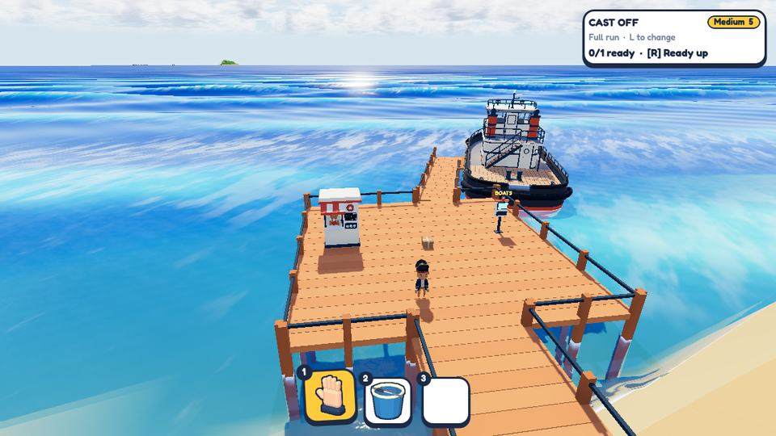
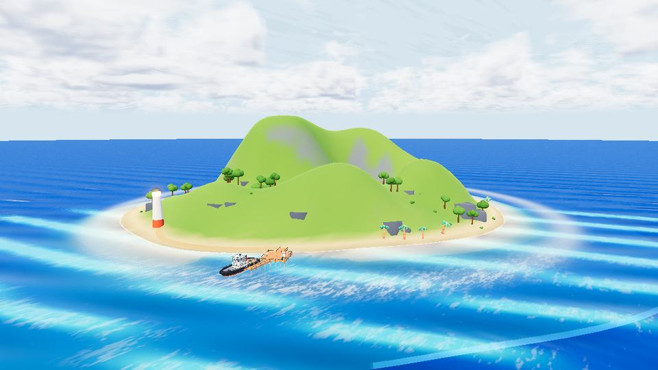
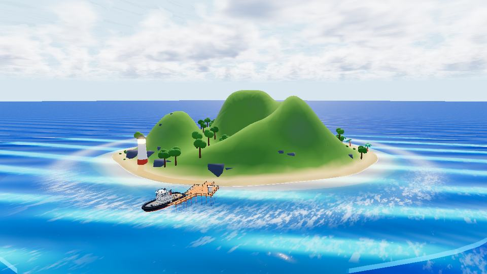

# A new harbour, and the first island pass — 30 September 2026

## A proper starting dock

The lobby now has a square main deck, with the shop on one side and the boat selector on the other.
A short angled branch leads to the boat. The fixed camera looks out from shore toward the dock and sea.

The approach is shorter, matches the rest of the deck and meets the island.
The dock is made from reusable sections, so other harbours can use the same pieces.
The shopkeeper follows the new layout to carry orders aboard.

## Islands: work in progress

The boats and ocean have outgrown the old island visuals. The first generator pass replaces
the mound and scattered props with noise-generated hills, grouped trees, rock outcrops and
a lighthouse path along the coast. Different seeds produce different layouts.

The first noise attempt made sharp peaks; the current pass rounds them off. It still looks
too much like a collection of bumps. Next is shaping most islands into broader grassy shelves,
rocky headlands and beach coves, with taller terrain less common. Chunky shapes and matte colours
remain the target.

These are development screenshots, not a new playtest release. The island look is still being worked on.
