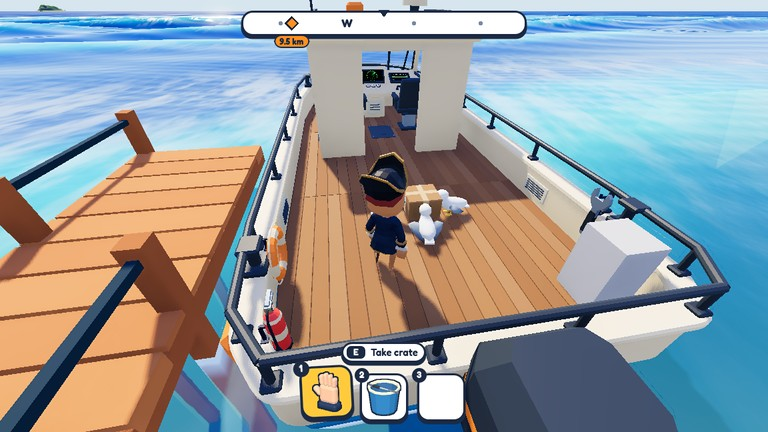
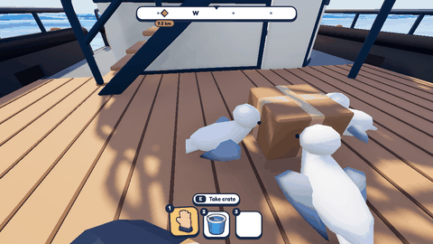
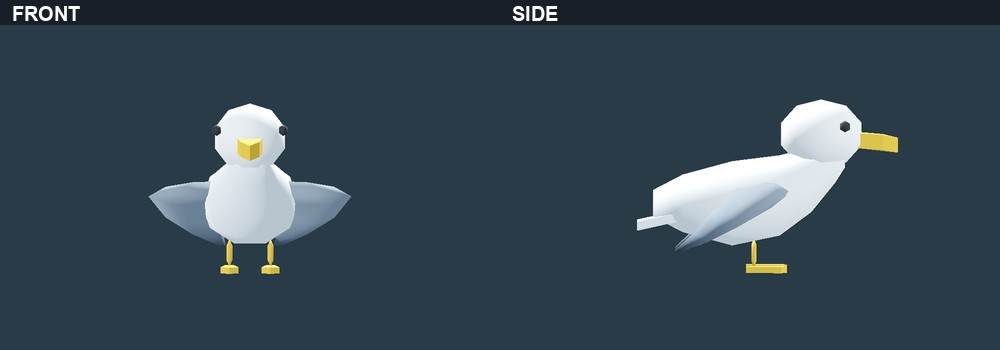

# Gulls on deck — 1 October 2026

## A small interruption during the crossing

Gulls can now land around the delivery crate during quieter stretches of a trip. They peck at the
straps, and ignoring them long enough can loosen the crate. After that, they can give it a few small
nudges. They cannot pick it up or fly away with it.

An empty-hand slap scares them away. Securing the crate again still uses the usual interaction.
The birds fit into the existing delivery task; they are not a separate job or hunting activity.

The prototype works across the host and clients. We have exercised joining, reconnecting and
simulated network delay, but a full human multiplayer voyage still needs playtesting.
There is also a gull arrival call and a subtle strap rattle before the crate comes loose.
The sound balance needs listening in the actual engine and wave mix.

## The model needs another direction

The bird art is not accepted yet. The first wings looked like paper tails. Folding them back,
slimming the body and correcting a colour import problem helped, but the model still does not
fit the game's style well enough.

The latest pass removed a bulky neck shape and moved the wing shoulders forward. Multiple close
views made the remaining problems clearer: the resting wings still flare out, and the head and
beak look too generic.

We are pausing here. Next is reviewing the overall silhouette against the boats, crew and props
before making another model pass. The gameplay prototype can stay while the art is reconsidered.

These are development captures, not a new playtest release.
